# Diagramas do Projeto — RA3 9 (Fase 3)

Este arquivo reúne os diagramas em **Mermaid** que ajudam a entender a
arquitetura, o fluxo de dados e a execução do analisador sintático LL(1)
acrescido da camada **semântica** da Fase 3.

> Atualização Fase 3: ver a §13 "Pré-processamento de comentários"
> abaixo (AFD ampliado com o estado `EM_COMENTARIO`) e o pipeline
> completo na §1, que agora inclui as etapas `construirTabelaSimbolos`,
> `verificarTipos`, `gerarArvoreAtribuida` e o controle de fluxo que
> impede geração de Assembly em presença de erros semânticos.
Todos podem ser visualizados diretamente no GitHub ou no VS Code com a
extensão *Markdown Preview Mermaid Support*.

> Sumário rápido: [Pipeline](#1-pipeline-end-to-end-fluxograma) ·
> [Módulos](#2-arquitetura-de-módulos-relação-entre-arquivos) ·
> [Construção da gramática](#3-construirgramatica--first--follow--tabela) ·
> [Parser LL(1)](#4-parser-ll1-com-pilha-passo-a-passo) ·
> [AFD da Fase 1](#5-afd-do-lexer-fase-1) ·
> [Estruturas de controle](#6-estruturas-de-controle-state-diagram) ·
> [AST](#7-tipos-de-nó-da-ast-classes) ·
> [Sequência completa](#8-sequência-completa-de-uma-execução) ·
> [Ponto fixo FIRST/FOLLOW](#9-firstfollow--fluxo-do-ponto-fixo) ·
> [Tabela LL(1)](#10-construção-da-tabela-ll1--fluxo-de-decisão) ·
> [Aridade no gerarArvore](#11-decisão-por-aridade-no-parse_expr-gerararvore) ·
> [Árvore de derivação LL(1)](#12-árvore-de-derivação-ll1-exemplo-real)

---

## 1. Pipeline end-to-end (fluxograma)

Visão macro do que acontece ao executar `python AnalisadorSemantico.py teste1.txt`.

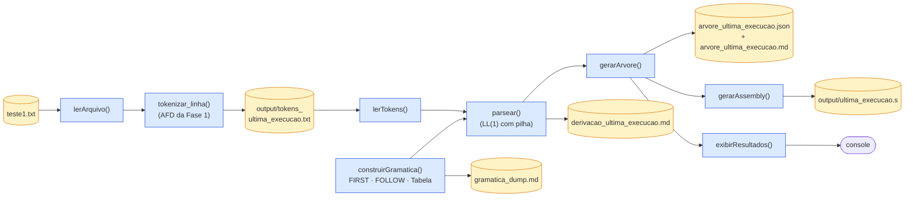

---

## 2. Arquitetura de módulos (relação entre arquivos)

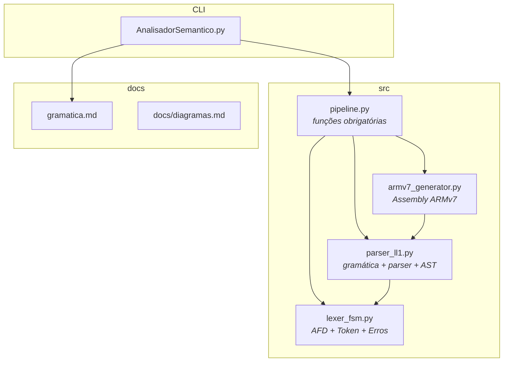

---

## 3. `construirGramatica()` — FIRST → FOLLOW → Tabela

Como a estrutura de dados retornada por `construirGramatica()` é montada.

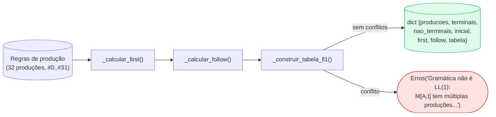

---

## 4. Parser LL(1) com pilha (passo a passo)

Algoritmo executado por `parsear(tokens, gram)`.

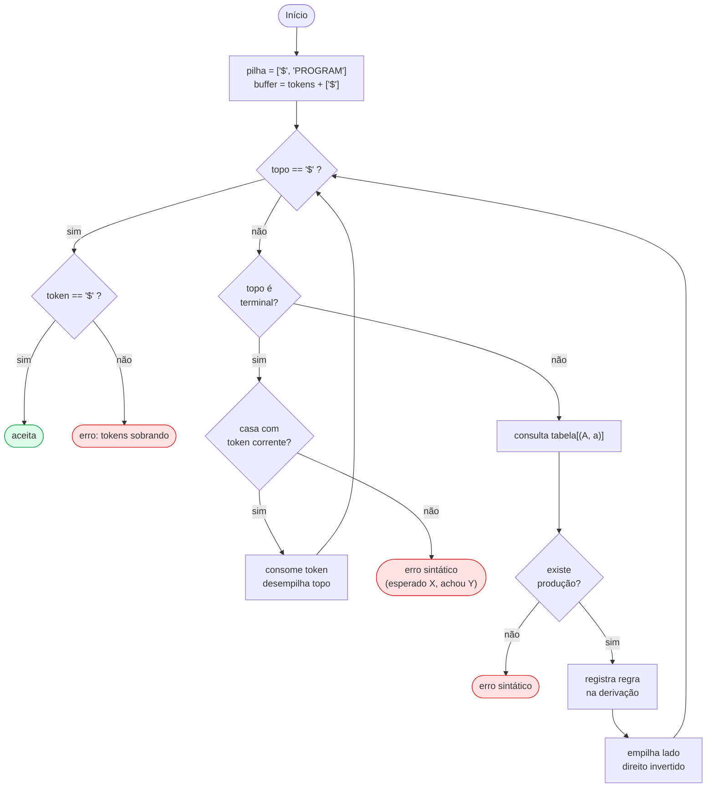

---

## 5. AFD do lexer (Fase 1)

Diagrama dos estados do AFD do lexer (Fase 1) que continua em uso na Fase 2,
agora reconhecendo também operadores relacionais e as keywords `IF`,
`IFELSE`, `WHILE`, `START`, `END`, `RES`. O **lexema** é mantido em
MAIÚSCULAS pelo lexer; a conversão para terminal minúsculo (`if`,
`while`, …) ocorre depois em `_token_para_terminal()`.

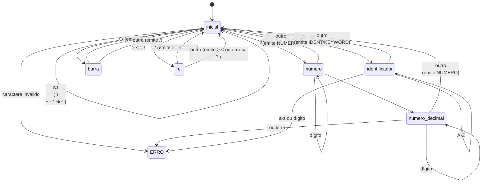

---

## 6. Estruturas de controle (state diagram)

Como o parser interpreta cada construção depois que a AST é montada.

### 6.1. IF / IFELSE

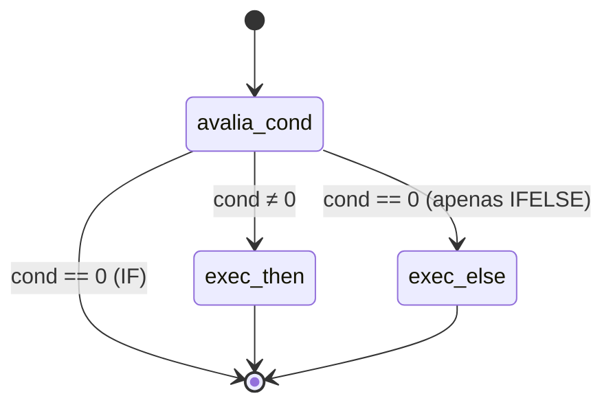

### 6.2. WHILE

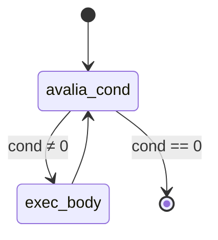

---

## 7. Tipos de nó da AST (classes)

Estrutura dos `dict`s produzidos por `gerarArvore()`. Útil para quem for
consumir `output/arvore_ultima_execucao.json`.

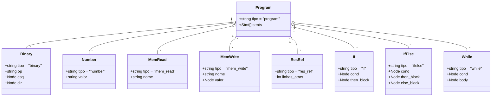

---

## 8. Sequência completa de uma execução

Interação entre os principais módulos quando o usuário roda
`python AnalisadorSemantico.py teste1.txt`.

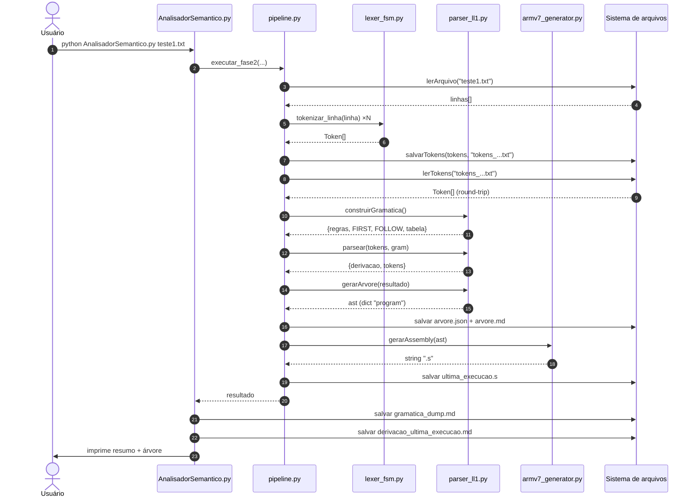

---

## 9. FIRST/FOLLOW — fluxo do ponto fixo

Como `_calcular_first` e `_calcular_follow` convergem por iteração até
nenhum conjunto mudar.

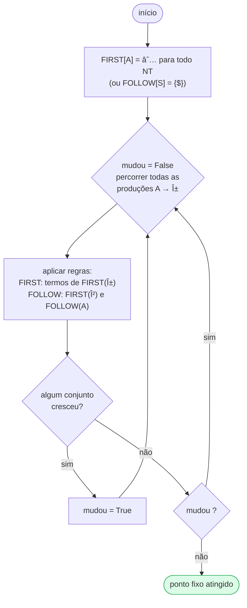

> A garantia de terminação vem do fato de que os conjuntos só
> **crescem** (são monótonos) e o universo de terminais é finito.

---

## 10. Construção da tabela LL(1) — fluxo de decisão

Como cada produção contribui para a tabela `M[A, t]` em
`_construir_tabela_ll1()`.

```mermaid
flowchart TD
    A([para cada produção A → α<br/>com índice idx]) --> B["calcular FIRST(α)"]
    B --> C{"para cada t ∈<br/>FIRST(α) − {ε}"}
    C --> D{"M[A,t] já<br/>existe?"}
    D -- não --> E["M[A,t] = idx"]
    D -- sim, mesma idx --> E
    D -- sim, outra produção --> X1(["registrar conflito"])
    E --> C
    C -- fim --> F{"ε ∈ FIRST(α) ?"}
    F -- não --> Z([próxima produção])
    F -- sim --> G{"para cada t ∈<br/>FOLLOW(A)"}
    G --> H{"M[A,t] já<br/>existe?"}
    H -- não --> I["M[A,t] = idx"]
    H -- sim, mesma idx --> I
    H -- sim, outra produção --> X2(["registrar conflito"])
    I --> G
    G -- fim --> Z
    Z --> A
    A -- fim --> R{"conflitos<br/>encontrados?"}
    R -- não --> OK([tabela pronta])
    R -- sim --> ERR(["raise Erros<br/>'Gramática não é LL(1)'"])

    classDef err fill:#fee2e2,stroke:#dc2626
    classDef ok fill:#dcfce7,stroke:#16a34a
    class X1,X2,ERR err
    class OK ok
```

---

## 11. Decisão por aridade no `parse_expr` (gerarArvore)

Como `gerarArvore()` usa o **número de itens** dentro dos parênteses
para escolher o tipo do nó da AST. Esse é o "outro lado" do que torna
a gramática LL(1): a palavra-chave/operador final de cada expressão é
o discriminador.

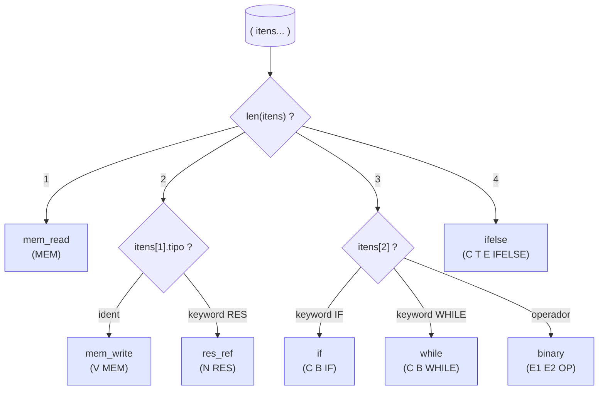

> Note que **a forma pós-fixada** da linguagem é o que permite essa
> decisão direta: o "verbo" (operador ou keyword) sempre aparece por
> último, depois que todos os operandos já foram lidos.

---

## 12. Árvore de derivação LL(1) (exemplo real)

A **árvore de derivação** (ou *parse tree*) mostra como o **analisador
sintático descendente recursivo do tipo LL(1)** expande os
